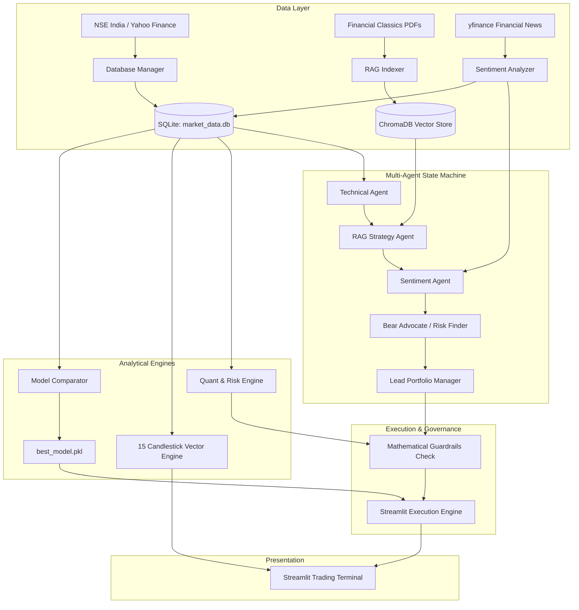
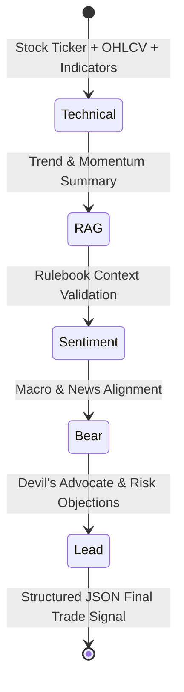

# 📈 AI-Powered NSE Stock Market Analyzer

An institutional-grade quantitative trading, machine learning, and multi-agent intelligence platform designed specifically for equities traded on the **National Stock Exchange of India (NSE)**.

The platform integrates **vectorized technical analysis**, **look-ahead-free machine learning**, **RAG-backed strategy validation** grounded in foundational financial literature, **news sentiment scoring**, **deterministic quantitative risk guardrails**, and a **LangGraph multi-agent debate assembly line**, all presented through an interactive **Streamlit** terminal.

---

## 📑 Table of Contents
1. [Executive Summary](#-executive-summary)
2. [High-Level Architecture](#-high-level-architecture)
3. [System Modules & Components](#-system-modules--components)
   - [1. Data Pipeline & Persistence (`src/data_pipeline/`)](#1-data-pipeline--persistence-srcdata_pipeline)
   - [2. Machine Learning Engine (`src/ml_engine/`)](#2-machine-learning-engine-srcml_engine)
   - [3. Quant & Risk Management Engine (`src/quant_engine/`)](#3-quant--risk-management-engine-srcquant_engine)
   - [4. RAG Strategy Knowledge Base (`src/rag_engine/`)](#4-rag-strategy-knowledge-base-srcrag_engine)
   - [5. Sentiment Engine (`src/sentiment_engine/`)](#5-sentiment-engine-srcsentiment_engine)
   - [6. LangGraph Multi-Agent Orchestrator (`src/agents/`)](#6-langgraph-multi-agent-orchestrator-srcagents)
   - [7. Interactive Streamlit Dashboard (`app/`)](#7-interactive-streamlit-dashboard-app)
4. [Data Flow & Execution Pipeline](#-data-flow--execution-pipeline)
5. [Deterministic Risk Rules & Guardrails](#-deterministic-risk-rules--guardrails)
6. [Supported Candlestick Patterns](#-supported-candlestick-patterns)
7. [Repository Structure](#-repository-structure)
8. [Installation & Setup](#-installation--setup)
9. [Running the Application](#-running-the-application)
10. [Configuration & Watchlist](#-configuration--watchlist)

---

## 🏛 Executive Summary

Traditional retail trading systems rely either solely on lagging technical indicators or ungrounded machine learning black boxes. The **AI-Powered NSE Stock Market Analyzer** solves this with a **defense-in-depth trading framework**:

- **No Future Data Leakage**: Features are 1-day lagged, and walk-forward cross-validation (`TimeSeriesSplit`) ensures models are benchmarked strictly out-of-sample.
- **RAG-Grounded Heuristics**: Trades are cross-referenced with seminal trading literature (*Steve Nison*, *William O'Neil*, *John J. Murphy*, *Saurabh Mukherjea*, and *Zerodha Varsity*).
- **Adversarial Multi-Agent Debate**: A LangGraph assembly line pits a Bullish Technical Analyst against a dedicated **Bear Advocate** before the **Lead Portfolio Manager** makes an execution decision.
- **Hard Mathematical Guardrails**: LLM hallucinations are vetoed by deterministic risk math (200 SMA long-term regime filter, RSI overbought cap, and ATR-based 1% account risk position sizing).

---

## 🧩 High-Level Architecture



---

## 🔬 System Modules & Components

### 1. Data Pipeline & Persistence (`src/data_pipeline/`)

- **`database_manager.py`**:
  - Central manager for SQLite database (`data/market_data.db`).
  - Maintains `daily_ohlcv` (timestamp, open, high, low, close, adj_close, volume) and `stock_sentiment` (scores, labels, summaries).
  - Handles schema migrations dynamically (e.g., adding `adj_close` to legacy databases).
  - Seeds up to 5 years (1825 days) of historical price action across 84 Nifty tickers via `yfinance` (with symbol normalizations like `TATAMOTORS -> TMPV`).
  - Implements incremental delta syncing (`update_latest_data`) and real-time live intraday candle upserts (`update_today_live_data`).
- **`broker_client.py`**:
  - Direct integration with official National Stock Exchange endpoints via `jugaad-data` for equity series (`EQ`).
  - Computes technical indicators natively using `pandas-ta` (20 EMA, 50 SMA, 200 SMA, 14 RSI, MACD, 14 ATR).
- **`update_daily.py`**:
  - Lightweight entrypoint for cron jobs or automated daily batch ingestion.

---

### 2. Machine Learning Engine (`src/ml_engine/`)

- **`model_comparator.py`**:
  - Rigorous walk-forward time-series benchmarking across **6 machine learning algorithms**:
    1. Logistic Regression
    2. Random Forest Classifier
    3. XGBoost Classifier
    4. LightGBM Classifier
    5. CatBoost Classifier
    6. Support Vector Machine (SVC with probabilistic output)
  - **Leakage Elimination**: All feature inputs are strictly 1-day lagged (`_lag1`) to avoid look-ahead bias.
  - **Validation**: Evaluates models using `TimeSeriesSplit(n_splits=5)`, picking the best model based on out-of-sample precision to minimize false-positive breakout trades.
  - Serializes the champion model to `data/models/best_model.pkl`.
- **`model_trainer.py`**:
  - Standalone baseline trainer using `XGBClassifier` with chronological 80/20 train/test split.
  - Predicts whether $Close_{t+1} > Close_{t}$.
- **`deep_learning_predictor.py`**:
  - 2-layer Bidirectional LSTM (Bi-LSTM) sequence model with dropout and residual linear heads.
  - Takes 30-period normalized sequential tensors of Open, High, Low, Close, Volume, 1d Return, Volatility, and RSI.
  - Forecasts the continuous multi-step price envelope: **Predicted Close, Predicted High, Predicted Low, Expected Return %, and Volatility Spread %**.
- **`candle_patterns.py`**:
  - High-performance, fully vectorized identification of 15 classic Japanese candlestick patterns using pure pandas and numpy boolean masks.

---

### 3. Quant Pricing & Risk Management Engine (`src/quant_engine/`)

- **`pricing_engine.py` (Institutional Multi-Factor Equity Pricing Engine)**:
  - **Volume-Weighted Microstructure**: Session-anchored VWAP and institutional volatility bands ($\pm 1\sigma, \pm 2\sigma$) for mean-reversion exhaustion and value absorption.
  - **Confluence Pivot Equations**: Camarilla Floor Pivots ($H3, H4, L3, L4$) and Fibonacci extensions ($1.618, 2.618$).
  - **Stochastic Merton Jump-Diffusion Monte Carlo**: 1,000 simulations over a 5-day horizon modeling Poisson jump intensity ($\lambda$) for news/earnings shocks, computing **Expected Terminal Price**, **95th Percentile Upside**, and **5-Day 95% Value at Risk (VaR)**.
  - **Multi-Factor Alpha Model**: Composite score spanning Momentum, Volume Force, and Mean Reversion.
  - **Statistical Market Regime Classification**: Classifies stocks into *Trending Bullish*, *Trending Bearish*, *Mean-Reverting Range*, or *High-Volatility Shock*.
  - **Theoretical Fair Value & Mispricing Edge**: Computes intrinsic auction center and **Alpha Mispricing %** ($\frac{P_{\text{fair}} - P_{\text{market}}}{P_{\text{market}}} \times 100\%$) to identify undervalued vs. overvalued setups.
- **`risk_math.py`**:
  - **Harmonized Volatility Levels**: Blends ATR volatility buffers ($1.5 \times \text{ATR}_{14}$) with Deep Learning bounds and Camarilla levels for tighter Stop-Losses and 1:2 / 1:3 profit targets.
  - **Position Sizing (1% Risk Rule)**:
    $$\text{Capital at Risk} = \text{Portfolio Size} \times 1\%$$
    $$\text{Position Size (Shares)} = \left\lfloor \frac{\text{Capital at Risk}}{|\text{Entry Price} - \text{Stop Loss}|} \right\rfloor$$
  - **Deterministic Safety Guardrails**:
    - *Confidence Guardrail*: Requires minimum confidence score ($\ge 70\%$) before triggering BUY/SELL.
    - *Regime Guardrail*: Vetoes BUY signals if price trades below the 200-day Simple Moving Average (downtrend regime filter).
    - *Overbought Guardrail*: Vetoes BUY signals if RSI(14) > 75 to prevent buying extended tops.

---

### 4. RAG Strategy Knowledge Base (`src/rag_engine/`)

- Grounded in canonical financial literature stored in `data/books/`:
  1. *Technical Analysis of the Financial Markets* — John J. Murphy
  2. *Japanese Candlestick Charting Techniques* — Steve Nison
  3. *How to Make Money in Stocks* — William J. O'Neil
  4. *Coffee Can Investing: The Low Risk Route to Stupendous Wealth* — Saurabh Mukherjea
  5. *Zerodha Varsity Trading Manuals*
- **`indexer.py`**:
  - Ingests PDFs, chunks content via `RecursiveCharacterTextSplitter` ($chunk\_size=1000, overlap=200$).
  - Batches embeddings via local Ollama (`nomic-embed-text`) into ChromaDB (`data/chromadb`).
- **`retriever.py`**:
  - Similarity search engine querying textbook literature to supply proven trading rules and historical context to the LangGraph agents.

---

### 5. Sentiment Engine (`src/sentiment_engine/`)

- **`sentiment_analyzer.py`**:
  - Scrapes real-time headlines for Nifty equities using `yfinance`.
  - Applies a financially-tuned lexicon weighting bullish terms (*surge, jump, gain, profit, rally, upgrade, beat*) vs. bearish terms (*fall, drop, loss, crash, bear, downgrade, miss, probe, slump*).
  - Normalizes scores in range $[-1.0, +1.0]$ and categorizes into `BULLISH`, `BEARISH`, or `NEUTRAL`.
  - Persists analysis history to `stock_sentiment` in SQLite.

---

### 6. LangGraph Multi-Agent Orchestrator (`src/agents/`)

Built as an assembly line state machine via `langgraph`:



- **`state.py`**: Defines `AgentTradingState` (ticker, price, data feeds, agent transcripts, and final signal).
- **`agent_nodes.py`**:
  - **Technical Agent**: Quant analyst diagnosing indicator confluence (RSI, EMAs, MACD).
  - **RAG Strategy Agent**: Validates technical setups against Murphy/Nison/O'Neil textbook rules.
  - **Sentiment Agent**: Synthesizes market news and sector conditions.
  - **Bear Advocate**: Dedicated devil's advocate probing for bull traps, hidden overhead resistance, and risk exposures.
  - **Lead Synthesizer**: Portfolio manager that weighs all inputs and enforces valid JSON execution:
    ```json
    {
      "action": "BUY" | "SELL" | "HOLD",
      "confidence_score": 0-100,
      "reasoning": "1 sentence executive summary"
    }
    ```
- **`orchestrator.py`**: Compiles the nodes into an executable LangGraph directed cyclic/acyclic graph.

---

### 7. Interactive Streamlit Dashboard (`app/`)

- **`app/main.py`**:
  - **Ticker Selector**: Dropdown powered by `config/watchlist.json` covering 84 Nifty stocks.
  - **Real-Time Metrics**: Latest close, percentage day-change, and news sentiment summary.
  - **ML Probability Gauge**: Evaluates the pre-trained champion model (`best_model.pkl`) to compute upward movement probability.
  - **Execution Signal Card**: Automatically calculates `Entry`, `Target Price (Take Profit)`, and `Stop-Loss Level` using ATR volatility.
  - **Interactive Plotly Candlestick Chart**: Zoomable OHLCV charts with volume and moving average overlays.
  - **15-Rule Candlestick Scanner**: Live visual grid displaying active/inactive candlestick patterns detected in the current session.
- **`app/components/`**:
  - `chart_view.py`: Specialized candlestick chart with shaded risk/reward zones (green for profit, red for risk).
  - `agent_cards.py`: Expandable cards presenting the full multi-agent transcript and debate.

---

## 🚦 Deterministic Risk Rules & Guardrails

| Guardrail Rule | Condition | Action Taken |
| :--- | :--- | :--- |
| **Minimum Confidence Threshold** | Confidence Score $< 70\%$ | Signal overridden to **HOLD** |
| **200-Day SMA Regime Filter** | Action = BUY and $Close < SMA_{200}$ | Vetoed to **HOLD** (Downtrend regime) |
| **RSI Overbought Filter** | Action = BUY and $RSI_{14} > 75$ | Vetoed to **HOLD** (Overextended top) |
| **Volatility Stop-Loss** | BUY or SELL | Placed at $1.5 \times ATR_{14}$ from entry |
| **Fixed Risk Position Sizing** | Account Size $\times 1\%$ | Capped at exact share count to limit downside |

---

## 🕯️ Supported Candlestick Patterns

The vectorized pattern detector in `candle_patterns.py` scans for:

1. **Doji** (Indecision)
2. **Bullish Marubozu** (Strong buyer dominance)
3. **Bearish Marubozu** (Strong seller dominance)
4. **Hammer** (Bullish reversal rejection)
5. **Shooting Star** (Bearish reversal rejection)
6. **Bullish Engulfing** (Two-candle bullish turnaround)
7. **Bearish Engulfing** (Two-candle bearish turnaround)
8. **Piercing Line** (Bullish recovery through mid-body)
9. **Dark Cloud Cover** (Bearish penetration into previous body)
10. **Morning Star** (Three-candle bullish reversal)
11. **Evening Star** (Three-candle bearish reversal)
12. **Three White Soldiers** (Sustained three-period bull march)
13. **Three Black Crows** (Sustained three-period bear rout)
14. **Spinning Top** (Equilibrium / contraction)
15. **Hanging Man** (Top reversal warning following uptrend)

---

## 📁 Repository Structure

```
AI Stock Market Analyzer/
├── app/
│   ├── components/
│   │   ├── agent_cards.py           # Multi-agent debate UI display
│   │   └── chart_view.py            # Plotly interactive charting with R:R bands
│   └── main.py                      # Main Streamlit web application
├── config/
│   └── watchlist.json               # 84-stock NSE Nifty watchlist
├── data/
│   ├── books/                       # Foundational finance PDFs for RAG
│   ├── chromadb/                    # Persistent vector database
│   ├── models/
│   │   ├── best_model.pkl           # Champion model after walk-forward validation
│   │   └── xgboost_model.pkl        # Baseline XGBoost binary
│   └── market_data.db               # SQLite database (OHLCV + Sentiment)
├── src/
│   ├── agents/
│   │   ├── agent_nodes.py           # LLM agent definitions (Ollama / Llama 3.2)
│   │   ├── orchestrator.py          # LangGraph state machine assembly line
│   │   └── state.py                 # TypedDict trading state schema
│   ├── backtesting/                 # Framework for historical strategy replay
│   ├── data_pipeline/
│   │   ├── broker_client.py         # jugaad-data NSE fetcher + indicators
│   │   ├── database_manager.py      # SQLite ingestion, seeding & syncing
│   │   └── update_daily.py          # Daily batch incremental updater
│   ├── ml_engine/
│   │   ├── candle_patterns.py       # 15 vectorized candlestick pattern detectors
│   │   ├── model_comparator.py      # 6-model walk-forward benchmark (TimeSeriesSplit)
│   │   └── model_trainer.py         # XGBoost model training pipeline
│   ├── quant_engine/
│   │   └── risk_math.py             # ATR levels, 1% sizing & deterministic guardrails
│   ├── rag_engine/
│   │   ├── indexer.py               # Book PDF chunking & Ollama vector indexing
│   │   └── retriever.py             # Chroma similarity search for trading rules
│   └── sentiment_engine/
│       └── sentiment_analyzer.py    # News headline scraper & sentiment scoring
├── .env                             # Environment variables & API keys
├── .gitignore                       # Git ignore filters
├── requirements.txt                 # Python package dependencies
└── README.md                        # Master repository documentation
```

---

## 🚀 Installation & Setup

### 1. Prerequisites
- **Python 3.10+**
- **Ollama** (for local LLMs & Embeddings):
  ```bash
  # Install Llama 3.2 and Nomic Embeddings
  ollama pull llama3.2
  ollama pull nomic-embed-text
  ```

### 2. Environment Setup
```bash
# Clone the repository
git clone https://github.com/rahulh1998/AI-Stock-Market-Analyzer.git
cd "AI Stock Market Analyzer"

# Create and activate virtual environment
python -m venv .venv
# On Windows:
.venv\Scripts\activate
# On Linux/macOS:
source .venv/bin/activate

# Install dependencies
pip install -r requirements.txt
```

### 3. Initialize Data & Models
```bash
# 1. Seed historical stock data into SQLite (5-year history)
python src/data_pipeline/database_manager.py

# 2. Index the financial literature into ChromaDB
python src/rag_engine/indexer.py

# 3. Benchmark ML models and export the champion classifier
python src/ml_engine/model_comparator.py

# 4. Fetch initial news sentiment
python src/sentiment_engine/sentiment_analyzer.py
```

---

## 🖥 Running the Application

Launch the Streamlit dashboard:

```bash
streamlit run app/main.py
```

Once running, navigate to `http://localhost:8501` in your browser.

---

## 📋 Configuration & Watchlist

The monitored equities can be customized at [`config/watchlist.json`](file:///c:/Users/rahul/OneDrive/Desktop/AI%20Stock%20Market%20Analyzer/config/watchlist.json). The system automatically tracks **84 top liquid tickers** across major sectors:

- **Banking & Financials**: HDFCBANK, ICICIBANK, SBIN, KOTAKBANK, AXISBANK, BAJFINANCE, BAJAJFINSV, CHOLAFIN, SHRIRAMFIN, MUTHOOTFIN
- **Information Technology**: TCS, INFY, HCLTECH, WIPRO, TECHM, LTIM, PERSISTENT, MPHASIS, COFORGE
- **Energy & Conglomerates**: RELIANCE, ONGC, NTPC, POWERGRID, COALINDIA, BPCL, IOC, GAIL
- **Automobile**: MARUTI, M&M, BAJAJ-AUTO, HEROMOTOCO, EICHERMOT, TVSMOTOR
- **Consumer Goods & Retail**: ITC, HINDUNILVR, TITAN, BRITANNIA, TATACONSUM, NESTLEIND, DABUR, MARICO, COLPAL, PIDILITIND
- **Metals & Mining**: TATASTEEL, JSWSTEEL, HINDALCO, VEDL, JINDALSTEL, NMDC, HINDZINC
- **Pharmaceuticals**: SUNPHARMA, CIPLA, DRREDDY, DIVISLAB, APOLLOHOSP
- **Capital Goods & Defense**: LT, SIEMENS, ABB, HAL, BEL
- **New-Age & Consumer Tech**: ZOMATO, PAYTM, NYKAA, POLICYBZR
