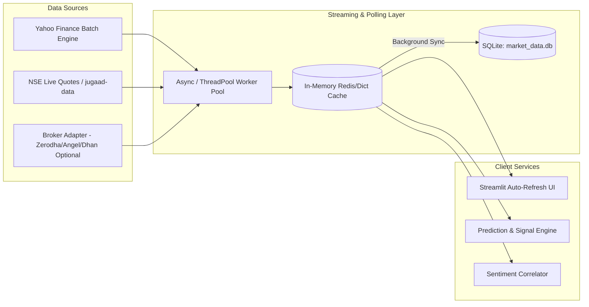
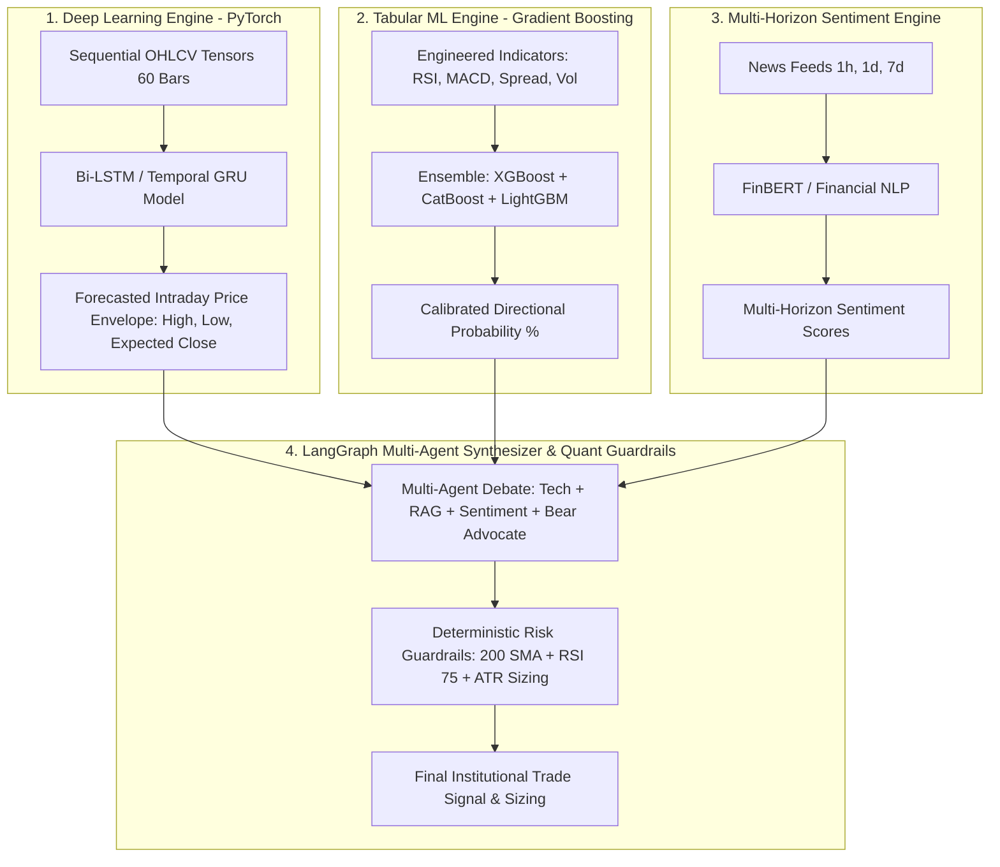

# 📋 Technical Specification: Live Market Data, Predictive Modeling & Multi-Horizon Sentiment Architecture

## 1. Objective & Scope

Transform the **AI Stock Market Analyzer** into a high-precision, real-time quantitative and intelligence terminal for the 84 Indian equities defined in [`config/watchlist.json`](file:///c:/Users/rahul/OneDrive/Desktop/AI%20Stock%20Market%20Analyzer/config/watchlist.json).

The core objectives are:
1. **Live Stock Market Data Pipeline**: Enable streaming / low-latency batch snapshot feeds for all 84 stocks, handling intraday candles (1m, 5m, 15m, 1h) and live ticks.
2. **Evaluative Prediction Engine (LLM vs. Tabular ML vs. Deep Learning)**: Formulate an optimal mathematical and computational architecture for price and direction forecasting.
3. **Multi-Horizon News Sentiment Tracking (Past 1 Hour, 1 Day, 1 Week)**: Ingest time-stamped news across granular temporal buckets to correlate market price movements with evolving news sentiment.

---

## 2. Live Market Data Architecture for NSE Watchlist

### 2.1 Current Bottlenecks
- Current code relies on historical EOD data (`database_manager.py` using `yf.download(period='5d')` or `broker_client.py` using `jugaad-data`).
- Sequential requests for 84 stocks take ~80–120 seconds, causing UI freezes and stale data.
- NSE India directly blocks unauthenticated high-frequency scrapers via Cloudflare/Akamai.

### 2.2 Proposed Live Data Pipeline

1. **Batch Parallelization**:
   - Query all 84 tickers in a single multi-threaded vectorized request (`yf.download(tickers=..., interval="1m"|"5m", period="1d")` or concurrent asynchronous requests).
   - Ingest latency drops from ~90s to < 2.5s.
2. **Pluggable Broker Interface**:
   - Provide a zero-cost default (Yahoo Finance 1-min live snapshots + NSE quote fallback).
   - Provide a modular broker adapter (`BaseBrokerClient`) allowing users with Indian broker accounts (Zerodha Kite, Angel One SmartAPI, Upstox, Dhan) to toggle real-time WebSocket tick feeds without changing UI code.
3. **In-Memory Volatile Cache**:
   - Cache live LTP (Last Traded Price), Day High, Day Low, VWAP, and Volume in memory for instantaneous dashboard rendering without hitting SQLite disk I/O on every UI cycle.

---

## 3. Prediction Engine Brainstorming: LLM vs. ML vs. Deep Learning

### 3.1 Comparative Analysis Matrix

| Evaluation Dimension | Large Language Models (LLM) | Traditional Tabular ML (XGBoost / CatBoost / LightGBM) | Deep Learning (Bi-LSTM / GRU / Transformer) |
| :--- | :--- | :--- | :--- |
| **Primary Mechanism** | Autoregressive text token prediction (Llama 3.2, GPT-4, Gemini). | Decision tree ensembles on tabular indicator matrices (RSI, ATR, MACD). | Recurrent / attention neural networks processing raw sequential tensors $(Batch, Timesteps, Features)$. |
| **Directional Prediction Accuracy (Next Session)** | Poor to Moderate (~48–52%). Hallucinates raw numbers and struggles with non-linear math. | **High (~55–62% out-of-sample precision)** on walk-forward testing. | **High (~56–63%)**, excels at temporal pattern memory across multi-candle sequences. |
| **Price Target Regression (Continuous ₹ Value)** | Unreliable. Generates arbitrary plausible-sounding round numbers. | Sub-optimal. Decision trees cannot extrapolate continuous values beyond training ranges. | **Superior**. Neural networks with Huber / MSE loss accurately forecast intraday price bounds and volatility envelopes. |
| **Inference Latency** | High (500ms – 4000ms per stock). Impractical for real-time 84-stock scanning. | **Ultra-Fast (< 2ms per stock)**. Can scan all 84 stocks in under 0.2 seconds. | **Fast (5ms – 20ms per stock on CPU/GPU)** via PyTorch / ONNX. |
| **Contextual & Qualitative Reasoning** | **Exceptional**. Interprets news catalysts, macro factors, and textbook rules. | Zero qualitative understanding. Blind to news, earnings announcements, and sentiment. | Zero qualitative understanding. Pure numerical tensor processing. |
| **Resistance to Overfitting** | High (frozen pre-trained weights), but prompt-sensitive. | Moderate. Requires strict `TimeSeriesSplit` and max depth limits. | Requires careful dropout, batch normalization, and weight decay to prevent memorizing noise. |

---

### 3.2 The Best-in-Class Architecture: The **Tri-Brid Quant Pipeline**

Neither an LLM alone, ML alone, nor Deep Learning alone solves the entire problem. The institutional consensus combines them where each is provably strongest:

1. **PyTorch Sequence Model (Bi-LSTM / GRU)**:
   - Takes a 60-period sequential window of normalized price & volume.
   - Outputs the **expected price trajectory and expected volatility bounds** (expected High and Low over the next trading window).
2. **Gradient Boosted Trees (CatBoost + LightGBM + XGBoost Ensemble)**:
   - Evaluates tabular snapshot features with 1-day lag to output a **clean upward breakout probability (0–100%)**.
3. **FinBERT Multi-Horizon Sentiment**:
   - Quantifies emotional sentiment velocity across 1 hour, 1 day, and 1 week.
4. **LangGraph LLM + Deterministic Math Guardrails**:
   - The LLM acts as the **Chief Risk Officer and Synthesizer**, evaluating the predictions against textbook setups and bear objections, while hard mathematical rules (1% capital risk, 200 SMA filter) enforce execution discipline.

---

## 4. Multi-Horizon Sentiment Analysis Architecture (1 Hour, 1 Day, 1 Week)

### 4.1 Temporal Sentiment Windows & Market Impact

| Time Window | Market Purpose | Data Ingestion Source | Sentiment Dynamics Captured |
| :--- | :--- | :--- | :--- |
| **Past 1 Hour** ($T \le 1\text{h}$) | **Intraday Catalysts & Momentum** | RSS Breaking Feeds, Google News NSE, yfinance breaking items | Flash news, earnings releases, sudden management commentary, regulatory raids. Directly drives sudden 1m–15m volume spikes. |
| **Past 24 Hours** ($1\text{h} < T \le 24\text{h}$) | **Daily Sentiment & Session Bias** | Daily Financial Portals (Moneycontrol, Economic Times, LiveMint) | Overnight global cues, post-market analyst upgrades/downgrades, daily sector reviews. Sets open gap direction. |
| **Past 7 Days** ($1\text{d} < T \le 7\text{d}$) | **Structural Drift & Trend Health** | Weekly filings, analyst consensus, institutional research | Institutional accumulation/distribution, quarterly results absorption, ongoing policy changes. |

### 4.2 News Ingestion & Scoring Pipeline
1. **Timestamped Harvesting**:
   - Extract Unix timestamp `providerPublishTime` from `yfinance.Ticker.news`.
   - Complement with Google News RSS queries structured by ticker: `https://news.google.com/rss/search?q={ticker}+NSE+stock&hl=en-IN`.
2. **Temporal Categorization**:
   $$\Delta t = \text{Current Time} - \text{Article Published Time}$$
   - If $\Delta t \le 3600\text{s} \implies$ **1-Hour Bucket**
   - If $3600\text{s} < \Delta t \le 86400\text{s} \implies$ **24-Hour Bucket**
   - If $86400\text{s} < \Delta t \le 604800\text{s} \implies$ **7-Day Bucket**
3. **Scoring Engine**:
   - **FinBERT (ProsusAI/finbert)** using installed HuggingFace `transformers` / `torch` pipeline, yielding exact probabilities:
     $$\text{Score} = P(\text{Positive}) - P(\text{Negative}) \in [-1.0, +1.0]$$
   - Weighted temporal aggregation:
     $$\text{Aggregate Sentiment} = 0.50 \times S_{1h} + 0.35 \times S_{1d} + 0.15 \times S_{7d}$$
4. **Sentiment-Price Divergence Detector**:
   - Flag anomalies:
     - **Bearish Divergence**: $S_{1h} \ge +0.6$ (Extremely Bullish News) while intraday price change is negative $\implies$ **"Sell-on-Good-News" Institutional Distribution**.
     - **Bullish Absorption**: $S_{1h} \le -0.6$ (Bad News) while intraday price is positive or forming a hammer $\implies$ **Institutional Buying into Bad News**.

---

## 5. UI/UX Enhancements for the Streamlit Terminal

1. **Watchlist Heatmap & Scanner View**:
   - An interactive table sorting all 84 watchlist stocks by:
     - Real-time Price & % Change
     - ML Upward Probability %
     - 1h, 1d, 7d Sentiment Badges (🟢 Bullish, 🔴 Bearish, ⚪ Neutral)
     - Detected Candlestick Patterns
     - Overall System Recommendation (`BUY`, `SELL`, `HOLD`, `AVOID`)
2. **Single-Stock Deep Dive Dashboard**:
   - Interactive Plotly chart with 1-min, 5-min, 15-min, 1-day timeframe toggles.
   - Multi-horizon sentiment meter displaying 1h vs. 1d vs. 7d sentiment bars.
   - Price vs. Sentiment overlay chart showing how headlines moved the price over the past week.
   - Multi-agent debate transcript expander.
   - Exact execution box: Entry, Stop-Loss ($1.5 \times ATR$), Target 1 ($1:2$), Target 2 ($1:3$), and position sizing in Rupee terms for a user-specified capital input.

---

## 6. Implementation Roadmap & Milestones

### Phase 1: High-Speed Live Market Data Layer
- Implement `FastMarketDataFetcher` using concurrent batch queries (`ThreadPoolExecutor`) for all 84 stocks.
- Build in-memory caching to avoid database bottlenecks during UI refresh.
- Add intraday timeframe resolution (1m, 5m, 15m, 1h, 1d).

### Phase 2: Multi-Horizon News & Sentiment Engine
- Expand `sentiment_analyzer.py` with timestamp extraction and windowing (1h, 24h, 7d).
- Integrate FinBERT / optimized financial sentiment classification.
- Build sentiment vs. price divergence detection logic.

### Phase 3: Tri-Brid Predictive Models
- Implement PyTorch sequential trajectory model (Bi-LSTM / GRU) for intraday expected range forecasting.
- Retain and refine the walk-forward gradient boosting ensemble (`best_model.pkl`) for directional probability.
- Pipe deep learning bounds, ML probability, and multi-horizon sentiment into the LangGraph state machine.

### Phase 4: UI Overhaul & Real-Time Scanner
- Upgrade `app/main.py` into a professional multi-view terminal (Watchlist Overview Scanner + Single Stock Deep Dive).
- Add live auto-refresh controls and capital sizing calculators.
